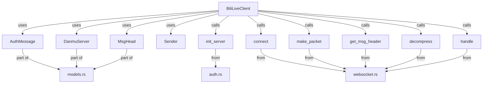

# API Reference

## Architecture Overview



---

## Core Components

### BiliLiveClient

The `BiliLiveClient` struct is the main entry point for interacting with Bilibili live streams via WebSocket. It manages the connection, authentication, heartbeat, and message receiving/processing.

```rust
pub struct BiliLiveClient {
    ws: WebSocket<TlsStream<TcpStream>>,
    auth_msg: String,
    ss: Sender<String>,
}
```

#### Methods

- `pub fn new(sessdata: &str, room_id: &str, r: Sender<String>) -> Self`
  
  Create a new client instance. Requires SESSDATA, room ID, and a channel sender for messages. Internally calls `init_server` and `connect` to establish the connection and authentication message.

- `pub fn send_auth(&mut self)`
  
  Send authentication packet to the server using the current auth message.

- `pub fn send_heart_beat(&mut self)`
  
  Send a heartbeat packet to keep the connection alive.

- `pub fn recive(&mut self)`
  
  Receive and process messages from the WebSocket. Handles danmaku and other events, and sends parsed messages to the provided channel.

- `pub fn parse_ws_message(&mut self, resv: Vec<u8>)`
  
  Parse a raw WebSocket message, dispatching to business logic or popularity updates.

- `pub fn parse_business_message(&mut self, h: MsgHead, b: &[u8])`
  
  Parse a business message (e.g., danmaku, gifts) and send to the channel if recognized.

#### Example

```rust
use client::websocket::BiliLiveClient;
use futures::channel::mpsc;

let (tx, _rx) = mpsc::channel(64);
let mut client = BiliLiveClient::new("<sessdata>", "<room_id>", tx);
client.send_auth();
client.send_heart_beat();
client.recive();
// then read the messages from the channel `_rx`
```

---

### Data Models

- `DanmuServer` — Represents a danmaku server endpoint.
  - Fields: `host`, `port`, `wss_port`, `ws_port`
- `MsgHead` — Represents a message header for protocol parsing.
  - Fields: `pack_len`, `raw_header_size`, `ver`, `operation`, `seq_id`
- `AuthMessage` — Authentication message structure for login.
  - Fields: `uid`, `roomid`, `protover`, `platform`, `type_`, `key`

---

### Utility Functions

- `init_server(sessdata: &str, room_id: &str) -> (Value, AuthMessage)`
  - Initializes authentication and retrieves server info.
- `connect(v: Value) -> (WebSocket<TlsStream<TcpStream>>, Response<Option<Vec<u8>>>)`
  - Establishes a WebSocket connection to the danmaku server.
- `make_packet(body: &str, ops: Operation) -> Vec<u8>`
  - Creates a protocol packet for authentication or heartbeat.
- `get_msg_header(v_s: &[u8]) -> MsgHead`
  - Parses a message header from raw bytes.
- `decompress(body: &[u8]) -> std::io::Result<Vec<u8>>`
  - Decompresses Brotli-compressed message bodies.
- `handle(json: Value) -> String`
  - Converts a parsed JSON message into a human-readable string (e.g., danmaku, gifts).

---

### Enum: Operation

```rust
pub enum Operation {
    AUTH,
    HEARTBEAT,
}
```

---

## Notes
- Only public and used APIs are shown here. For more details, see the source code and integration example in `src/bin/integration_bili_live_client.rs`.
- The architecture diagram above shows the relationship between the main components and data flow.
