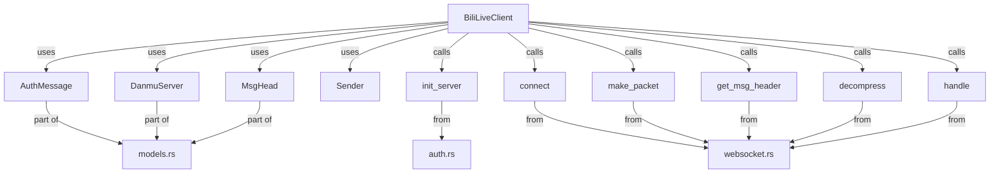
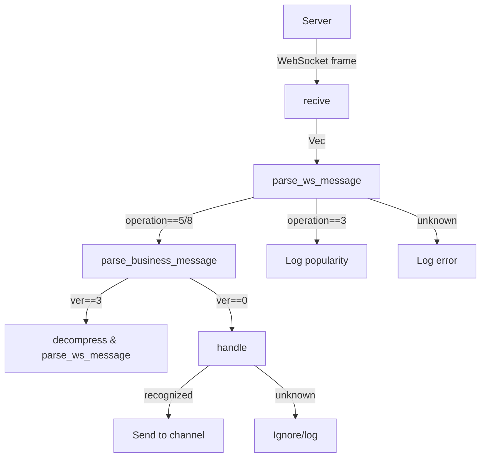

# API Reference

## Architecture Overview



---

## Core Components

### BiliLiveClient

The `BiliLiveClient` struct is the main entry point for interacting with Bilibili live streams via WebSocket. It manages the connection, authentication, heartbeat, and message receiving/processing.

```rust
pub struct BiliLiveClient {
    ws: WebSocket<TlsStream<TcpStream>>,
    auth_msg: String,
    ss: Sender<String>,
}
```

#### Methods

- `pub fn new(sessdata: &str, room_id: &str, r: Sender<String>) -> Self`
  
  Create a new client instance. Requires SESSDATA, room ID, and a channel sender for messages. Internally calls `init_server` and `connect` to establish the connection and authentication message.

- `pub fn send_auth(&mut self)`
  
  Send authentication packet to the server using the current auth message.

- `pub fn send_heart_beat(&mut self)`
  
  Send a heartbeat packet to keep the connection alive.

- `pub fn recive(&mut self)`
  
  Receive and process messages from the WebSocket. Handles danmaku and other events, and sends parsed messages to the provided channel.

- `pub fn parse_ws_message(&mut self, resv: Vec<u8>)`
  
  Parse a raw WebSocket message, dispatching to business logic or popularity updates.

- `pub fn parse_business_message(&mut self, h: MsgHead, b: &[u8])`
  
  Parse a business message (e.g., danmaku, gifts) and send to the channel if recognized.

#### Example

```rust
use client::websocket::BiliLiveClient;
use futures::channel::mpsc;

let (tx, _rx) = mpsc::channel(64);
let mut client = BiliLiveClient::new("<sessdata>", "<room_id>", tx);
client.send_auth();
client.send_heart_beat();
client.recive();
// then read the messages from the channel `_rx`
```

---

## Message Handling Flow



The message handling in `BiliLiveClient` works as follows:

1. **Receiving Data**: The `recive()` method reads raw WebSocket frames from the server. If a message is available, it is passed to `parse_ws_message()`.
2. **Parsing Message Header**: `parse_ws_message()` extracts the protocol header using `get_msg_header()`, which determines the message type (operation code).
3. **Dispatching by Operation**:
    - If `operation == 5` or `8`: The message is a business message (e.g., danmaku, gift) or a heartbeat reply. The method loops through all protocol packets in the frame, calling `parse_business_message()` for each.
    - If `operation == 3`: The message contains the current room popularity (viewer count), which is logged.
    - Otherwise: The message is unknown and logged as an error.
4. **Business Message Handling**: In `parse_business_message()`:
    - If the message is compressed (`ver == 3`), it is decompressed and recursively parsed.
    - If the message is JSON (`ver == 0`), it is parsed and passed to `handle()`, which formats it as a human-readable string (e.g., "user sent danmaku").
    - Recognized messages are sent to the channel (`Sender<String>`) for further processing or display.
    - Unknown or unsupported formats are logged as errors.

#### Supported Message Types
- **Danmaku (弹幕)**: Chat messages sent by users.
- **Gift**: Gifts sent by users.
- **Popularity**: Viewer count updates.
- **Other**: Unrecognized messages are ignored or logged.

#### Example Message Flow
1. Server sends a WebSocket frame.
2. `recive()` reads the frame.
3. `parse_ws_message()` splits the frame into protocol packets.
4. For each packet:
    - If business message, `parse_business_message()` parses and sends to channel.
    - If popularity, logs the count.
    - Otherwise, logs error.

---

### Data Models

- `DanmuServer` — Represents a danmaku server endpoint.
  - Fields: `host`, `port`, `wss_port`, `ws_port`
- `MsgHead` — Represents a message header for protocol parsing.
  - Fields: `pack_len`, `raw_header_size`, `ver`, `operation`, `seq_id`
- `AuthMessage` — Authentication message structure for login.
  - Fields: `uid`, `roomid`, `protover`, `platform`, `type_`, `key`

---

### Utility Functions

- `init_server(sessdata: &str, room_id: &str) -> (Value, AuthMessage)`
  - Initializes authentication and retrieves server info.
- `connect(v: Value) -> (WebSocket<TlsStream<TcpStream>>, Response<Option<Vec<u8>>>)`
  - Establishes a WebSocket connection to the danmaku server.
- `make_packet(body: &str, ops: Operation) -> Vec<u8>`
  - Creates a protocol packet for authentication or heartbeat.
- `get_msg_header(v_s: &[u8]) -> MsgHead`
  - Parses a message header from raw bytes.
- `decompress(body: &[u8]) -> std::io::Result<Vec<u8>>`
  - Decompresses Brotli-compressed message bodies.
- `handle(json: Value) -> String`
  - Converts a parsed JSON message into a human-readable string (e.g., danmaku, gifts).

---

### Enum: Operation

```rust
pub enum Operation {
    AUTH,
    HEARTBEAT,
}
```

---

## Notes
- Only public and used APIs are shown here. For more details, see the source code and integration example in `src/bin/integration_bili_live_client.rs`.
- The architecture diagram above shows the relationship between the main components and data flow.
- The message handling section above explains how incoming messages are processed and dispatched.

---

## Scheduler/Event Trigger System

The scheduler module provides a flexible event trigger system for handling Bilibili live messages (`BiliMessage`). It supports both parallel and sequential event handler execution using a staged architecture.

### Key Concepts

- **EventHandler Trait**: Implement this trait to define custom handlers for `BiliMessage` events.
- **Scheduler**: Manages event handler registration and message dispatch. Handlers are organized into stages:
    - Each stage is a group of handlers run in parallel.
    - Stages themselves are executed sequentially.
- **API**:
    - `add_stage(Vec<Arc<dyn EventHandler>>)` — Add a parallel stage.
    - `add_sequential_handler(Arc<dyn EventHandler>)` — Add a single handler as a sequential stage.
    - `trigger(BiliMessage)` — Dispatch a message through all stages.

### Example Usage

```rust
let mut scheduler = Scheduler::new();
// Add two handlers to run in parallel
scheduler.add_stage(vec![Arc::new(MyHandler1), Arc::new(MyHandler2)]);
// Add a sequential handler
scheduler.add_sequential_handler(Arc::new(MyHandler3));

// When a BiliMessage is received:
scheduler.trigger(msg);
```

### Test Coverage
- The scheduler is tested with both parallel and sequential handler registration.
- Integration with `mpsc::channel` is verified for real-world message passing scenarios.

This design ensures extensibility and robust event-driven processing for Bilibili live room applications.
