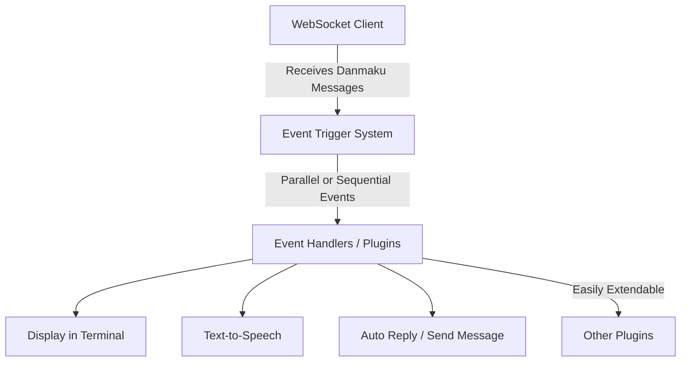

# Architecture of BliveDm_rs

## Preliminaries

The previous version of the documentation can be found [here](https://open-live.bilibili.com/document/657d8e34-f926-a133-16c0-300c1afc6e6b) (as of 2024). In April 2025, Bilibili released an updated [documentation page](https://open.bilibili.com/doc/4/19350a57-2e2d-43cf-3e6d-c7de132b24b6). 

The main difference in the new documentation is the requirement to use OAuth 2.0 for live functions. This means developers must register on the Bilibili Open Platform. However, due to increased risk controls, live features may no longer be available to **personal developers** in the future. As a result, the old version of the API may eventually stop working.

## Architecture Overview

All core functions of this project are based on receiving and processing live danmaku (chat) messages from Bilibili live rooms. The main architectural components are:

1. **WebSocket Client**  
   The system uses a WebSocket client to connect to a Bilibili live room and receive danmaku messages in real time. If using the APP OAuth method, registration on the Bilibili Open Platform is required.

2. **Event Trigger System (Schedule)**  
   When a danmaku message is received, it triggers corresponding events in the application.  
   - Events can be triggered in parallel, allowing multiple handlers to process messages simultaneously.
   - Alternatively, events can be triggered in a chain (sequentially), preserving the order of message handling.
   - This event trigger mechanism is a core part of the application, supporting both parallel and sequential processing.

3. **Event Handlers (Plugin System)**  
   Event handlers define how the application responds to danmaku messages. Examples include:
   - Displaying information in the terminal
   - Converting messages to speech
   - Automatically replying or sending messages back to the live room  
   The architecture is designed as a plugin system, making it easy to add new features or handlers as needed.

This modular approach ensures flexibility, extensibility, and maintainability for handling live danmaku messages.

