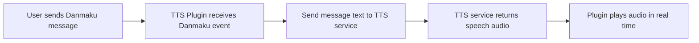

# Plugins Crate

This crate provides plugin implementations for the BiliLiveDanmu system. Plugins are designed to process and respond to BiliMessage events in a modular and extensible way.

## Example Plugin: Terminal Display

The `terminal_display` plugin prints incoming BiliMessage events (such as danmaku and gifts) to the terminal. It implements the `EventHandler` trait from the `client` crate.

### Usage

Add the plugin handler to your scheduler:

```rust
use plugins::terminal_display::TerminalDisplayHandler;
use client::scheduler::Scheduler;
use std::sync::Arc;

let mut scheduler = Scheduler::new();
let handler = Arc::new(TerminalDisplayHandler);
scheduler.add_sequential_handler(handler);
```

When a message is triggered, the handler will print it to the terminal.

## Adding New Plugins

To add a new plugin, implement the `EventHandler` trait for your struct and register it with the scheduler.

---

## TTS Plugin

The TTS (Text-to-Speech) plugin enables your application to read out text messages using a TTS service. This service can be either local or remote.

### How it works



- When a user sends a message (Danmaku event) in the live room, the plugin receives the event.
- The plugin sends the message text to the configured TTS service.
- The TTS service converts the text into speech audio.
- The plugin plays the generated audio in real time.

### Usage

Add the TTS plugin handler to your scheduler. You can specify the TTS command and arguments (for example, to use a Chinese voice on macOS):

```rust
use plugins::tts_handler;
use client::scheduler::Scheduler;
use std::sync::Arc;

let mut scheduler = Scheduler::new();
// For macOS Chinese voice:
let tts = tts_handler(
    "say".to_string(),
    vec!["-v".to_string(), "SinJi".to_string()]
);
scheduler.add_sequential_handler(tts);
```

On Linux (Arch Linux), you can use `espeak-ng` with Chinese voice:

```rust
let tts = tts_handler(
    "espeak-ng".to_string(),
    vec!["-v".to_string(), "cmn".to_string()]
);
scheduler.add_sequential_handler(tts);
```

On other platforms, you can use a different TTS command, such as `echo` for testing:

```rust
let tts = tts_handler("echo".to_string(), vec![]);
scheduler.add_sequential_handler(tts);
```

### Implementation

The TTS plugin implements the `EventHandler` trait. On receiving a `Danmaku` event, it processes the message as described above, passing the text to the configured TTS command with any additional arguments.

This allows you to add voice feedback to your live room, making interactions more engaging and accessible.