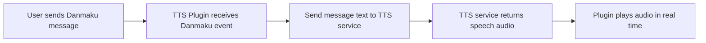

# Plugins Crate

This crate provides plugin implementations for the BiliLiveDanmu system. Plugins are designed to process and respond to BiliMessage events in a modular and extensible way.

## Example Plugin: Terminal Display

The `terminal_display` plugin prints incoming BiliMessage events (such as danmaku and gifts) to the terminal. It implements the `EventHandler` trait from the `client` crate.

### Usage

Add the plugin handler to your scheduler:

```rust
use plugins::terminal_display::TerminalDisplayHandler;
use client::scheduler::Scheduler;
use std::sync::Arc;

let mut scheduler = Scheduler::new();
let handler = Arc::new(TerminalDisplayHandler);
scheduler.add_sequential_handler(handler);
```

When a message is triggered, the handler will print it to the terminal.

## Adding New Plugins

To add a new plugin, implement the `EventHandler` trait for your struct and register it with the scheduler.

---

## TTS Plugin

The TTS (Text-to-Speech) plugin enables your application to read out text messages using a TTS service. This service can be either local or remote.

### How it works



- When a user sends a message (Danmaku event) in the live room, the plugin receives the event.
- The plugin sends the message text to the configured TTS service.
- The TTS service converts the text into speech audio.
- The plugin plays the generated audio in real time.

### Usage

Add the TTS plugin handler to your scheduler. The TTS plugin now uses a REST API service for text-to-speech conversion:

```rust
use plugins::{tts_handler_default, tts_handler};
use client::scheduler::Scheduler;
use std::sync::Arc;

let mut scheduler = Scheduler::new();

// Using default Chinese voice settings (recommended):
let tts = tts_handler_default("http://localhost:8000".to_string());
scheduler.add_sequential_handler(tts);
```

For custom voice configuration:

```rust
let tts = tts_handler(
    "http://localhost:8000".to_string(),    // TTS server URL
    Some("zh-CN-XiaoxiaoNeural".to_string()), // Voice ID
    Some("edge".to_string()),                  // Backend (edge, xtts, piper)
    Some("high".to_string()),                  // Quality (low, medium, high)
    Some("wav".to_string()),                   // Format
    Some(44100),                               // Sample rate
);
scheduler.add_sequential_handler(tts);
```

The plugin requires a running danmu-tts server. You can start the server following the instructions in the [danmu-tts repository](https://github.com/jiahaoxiang2000/danmu-tts).

### Setting up the TTS Server

The TTS functionality depends on the [danmu-tts](https://github.com/jiahaoxiang2000/danmu-tts) project, which provides a REST API server for text-to-speech conversion.

#### Quick Setup

1. **Clone the TTS server repository:**
   ```bash
   git clone https://github.com/jiahaoxiang2000/danmu-tts.git
   cd danmu-tts
   ```

2. **Follow the setup instructions** in the danmu-tts repository to install dependencies and configure the server.

3. **Start the TTS server:**
   ```bash
   # The server typically runs on port 8000
   # See danmu-tts documentation for specific startup commands
   ```

4. **Configure your blivedm_rs application** to use the TTS server:
   ```rust
   // Use localhost if running on the same machine
   let tts = tts_handler_default("http://localhost:8000".to_string());
   
   // Or use a remote server IP
   let tts = tts_handler_default("http://192.168.1.100:8000".to_string());
   ```

The danmu-tts server supports multiple TTS backends and provides high-quality neural voices, making it ideal for live streaming applications.

### Implementation

The TTS plugin has been redesigned to use a REST API service instead of local TTS commands. Key features include:

#### REST API Integration
- Sends HTTP POST requests to `/tts` endpoint
- Supports JSON request/response format
- Configurable voice, backend, quality, and format options
- Base64 encoded audio data response

#### Sequential Processing
- Uses a worker thread with message queue for sequential TTS processing
- Prevents audio overlap and ensures proper message ordering
- Non-blocking for the main event loop

#### Supported TTS Backends
- **Edge TTS**: Microsoft's neural voices (recommended for Chinese)
- **XTTS**: High-quality cloned voices
- **Piper**: Fast local inference

#### Configuration Options
- `server_url`: Base URL of the TTS server
- `voice`: Voice ID (e.g., "zh-CN-XiaoxiaoNeural")
- `backend`: TTS backend ("edge", "xtts", "piper")
- `quality`: Audio quality ("low", "medium", "high")
- `format`: Audio format ("wav")
- `sample_rate`: Sample rate (22050, 44100, etc.)

#### Error Handling
- Graceful handling of network errors
- Logging of TTS generation metadata
- Continuation on individual request failures

This allows you to add voice feedback to your live room, making interactions more engaging and accessible.